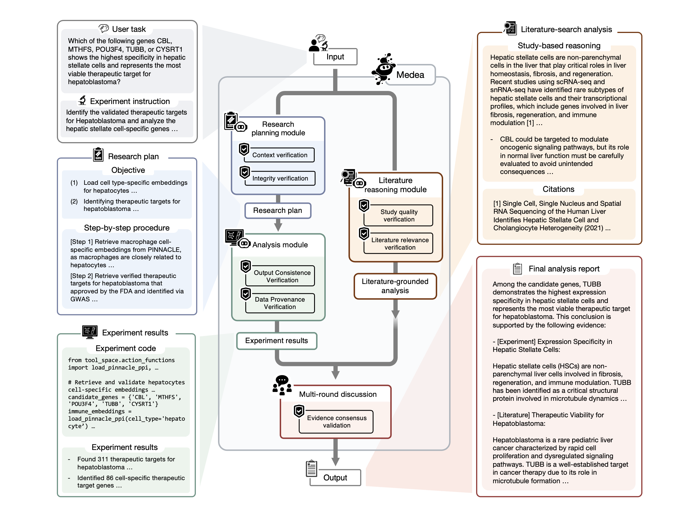

<!-- <h1 align="center">Medea: An omics AI agent for therapeutics</h1> -->

<p align="center">
  
</p>

<p align="center">
  <a href="https://docs.astral.sh/uv/"></a>
  <a href="https://github.com/SalesforceAIResearch/AgentLite"></a>
  <a href="https://openrouter.ai/"></a>
</p>

<p align="center">
  <a href="https://arxiv.org/abs/TODO"></a>
  <a href="https://medea.openscientist.ai/"></a>
  <a href="https://huggingface.co/datasets/mims-harvard/MedeaDB"></a>
</p> 

-----
**Medea**, an AI agent to accelerate therapeutic discovery through multi-omics analysis. Built on the AgentLite framework, Medea addresses a fundamental challenge in biomedical research: how to effectively integrate diverse data modalities, computational resources, and scientific knowledge to identify therapeutic targets and predict drug responses.

Medea consists of three specialized agentic modules that collaborate with each other:

1. **Research Planning module** - Formulates experimental plans, verifies biological context (diseases, cell types, genes), and ensures analytical feasibility
2. **Analysis module** - Generates and executes Python code for single-cell data analysis, including quality checks and debugging
3. **Literature Reasoning module** - Searches, filters, and synthesizes relevant scientific papers using LLM-based relevance assessment

<p align="center">
  
  <br>
  <em>Overview of Medea</em>
</p>

## 📋 Table of Contents

- [Installation](#installation)
- [Configuration](#configuration)
- [Using Medea as a Library](#using-medea-as-a-library)
- [Command-Line Interface (CLI) Usage](#command-line-interface-cli-usage)
- [Documentation](#documentation)


## Installation

### Quick Install

```bash
# Clone the repository
git clone https://github.com/mims-harvard/Medea.git
cd Medea

# Create virtual environment with uv (recommended)
pip install uv
uv venv medea --python 3.10
source medea/bin/activate  # On Windows: medea\Scripts\activate

# Install Medea
uv pip install -e .
uv pip install openai==1.82.1  # Ensure correct OpenAI version
```

### Download MedeaDB

Download required datasets from Hugging Face:

```bash
uv pip install -U huggingface_hub
huggingface-cli login  # Enter your token
brew install git-lfs  # macOS, or: sudo apt-get install git-lfs (Linux)
git lfs install
git clone https://huggingface.co/datasets/mims-harvard/MedeaDB
```

**📚 Detailed guide**: See [docs/QUICKSTART.md](docs/QUICKSTART.md)

## Configuration

Create a `.env` file in the project root:

```bash
cp env_template.txt .env
```

### Required Settings

```bash
# Database path
MEDEADB_PATH=/path/to/MedeaDB

# Model configuration
BACKBONE_LLM=gpt-4o
SEED=42

# API Key (recommended: OpenRouter for access to 100+ models)
OPENROUTER_API_KEY=your-key-here
USE_OPENROUTER=true
```

### Alternative API Configurations

**Azure OpenAI**:
```bash
AZURE_OPENAI_API_KEY=your-key
AZURE_OPENAI_ENDPOINT=https://your-resource.openai.azure.com/
AZURE_API_VERSION=2024-10-21
USE_OPENROUTER=false
```

**Google Gemini**:
```bash
GEMINI_API_KEY=your-key
GEMINI_MODEL=gemini-2.0-flash-exp
```

**Anthropic Claude**:
```bash
ANTHROPIC_API_KEY=your-key
ANTHROPIC_MODEL=claude-3-5-sonnet-20241022
```

**NVIDIA DeepSeek**:
```bash
NVIDIA_DEEPSEEK_ENDPOINT=https://your-endpoint.com/v1
NVIDIA_DEEPSEEK_API_KEY=your-key
```

**📋 Full configuration reference**: See [env_template.txt](env_template.txt)

## Using Medea as a Library

Once installed, you can use Medea in your own Python scripts. Here are three simple ways to get started:

### 🚀 Option 1: Full Medea Agent (Recommended)

Run the complete Medea agent with research planning, analysis, and literature reasoning modules:

```python
import os
from medea import medea, AgentLLM, LLMConfig
from medea import ResearchPlanning, Analysis, LiteratureReasoning
from medea import (
    ResearchPlanDraft, ContextVerification, IntegrityVerification,
    CodeGenerator, AnalysisExecution, CodeDebug, AnalysisQulityChecker,
    LiteratureSearch, PaperJudge, OpenScholarReasoning
)

# Step 1: Initialize LLMs
backbone_llm = "gpt-4o"
llm_config = LLMConfig({"temperature": 0.4})
research_llm = AgentLLM(llm_config, llm_name=backbone_llm)
analysis_llm = AgentLLM(llm_config, llm_name=backbone_llm)
literature_llm = AgentLLM(llm_config, llm_name=backbone_llm)

# Step 2: Configure module specific actions
research_actions = [
    ResearchPlanDraft(tmp=0.4, llm_provider=backbone_llm),
    ContextVerification(tmp=0.4, llm_provider=backbone_llm),
    IntegrityVerification(tmp=0.4, llm_provider=backbone_llm, max_iter=2)
]

analysis_actions = [
    CodeGenerator(tmp=0.4, llm_provider=backbone_llm),
    AnalysisExecution(),
    CodeDebug(tmp=0.4, llm_provider=backbone_llm),
    AnalysisQulityChecker(tmp=0.4, llm_provider=backbone_llm, max_iter=2)
]

literature_actions = [
    LiteratureSearch(model_name=backbone_llm, verbose=True),
    PaperJudge(model_name=backbone_llm, verbose=True),
    OpenScholarReasoning(tmp=0.4, llm_provider=backbone_llm, verbose=True)
]

# Step 3: Create module
research_planning_module = ResearchPlanning(llm=research_llm, actions=research_actions)
analysis_module = Analysis(llm=analysis_llm, actions=analysis_actions)
literature_module = LiteratureReasoning(llm=literature_llm, actions=literature_actions)

# Step 4: Run Medea
result = medea(
    user_instruction="Which gene is the best therapeutic target for RA in CD4+ T cells?",
    experiment_instruction=None,  # Optional: additional experiment context
    research_planning_module=research_planning_module,
    analysis_module=analysis_module,
    literature_module=literature_module,
    debate_rounds=2,  # Number of panel discussion rounds
    timeout=800  # Timeout in seconds per process
)

# Step 5: Get your answer
print(result['CGRH'])  # Final hypothesis from panel discussion
print(result['P'])     # Research plan
print(result['CG'])    # In-silico experiment result
print(result['R'])     # Literature reasoning
```

### 🔬 Option 2: Research Planning + In-Silico Experiment Only

Run computational experiments without literature search:

```python
from medea import experiment_analysis, AgentLLM, LLMConfig
from medea import ResearchPlanning, Analysis
from medea import (
    ResearchPlanDraft, ContextVerification, IntegrityVerification,
    CodeGenerator, AnalysisExecution, CodeDebug, AnalysisQulityChecker
)

# Step 1: Initialize LLMs
backbone_llm = "gpt-4o"
llm_config = LLMConfig({"temperature": 0.4})
research_llm = AgentLLM(llm_config, llm_name=backbone_llm)
analysis_llm = AgentLLM(llm_config, llm_name=backbone_llm)

# Step 2: Configure actions
research_actions = [
    ResearchPlanDraft(tmp=0.4, llm_provider=backbone_llm),
    ContextVerification(tmp=0.4, llm_provider=backbone_llm),
    IntegrityVerification(tmp=0.4, llm_provider=backbone_llm, max_iter=2)
]

analysis_actions = [
    CodeGenerator(tmp=0.4, llm_provider=backbone_llm),
    AnalysisExecution(),
    CodeDebug(tmp=0.4, llm_provider=backbone_llm),
    AnalysisQulityChecker(tmp=0.4, llm_provider=backbone_llm, max_iter=2)
]

# Step 3: Create modules
research_planning_module = ResearchPlanning(llm=research_llm, actions=research_actions)
analysis_module = Analysis(llm=analysis_llm, actions=analysis_actions)

# Step 4: Run experiment
plan, result = experiment_analysis(
    query="Identify therapeutic targets for rheumatoid arthritis in CD4+ T cells",
    research_planning_module=research_planning_module,
    analysis_module=analysis_module
)

print(f"Research Plan:\n{plan}\n")
print(f"Experiment Result:\n{result}")
```

### 📚 Option 3: Literature Reasoning Only

Search papers and synthesize insights without computational experiments:

```python
from medea import literature_reasoning, AgentLLM, LLMConfig
from medea import LiteratureReasoning
from medea import LiteratureSearch, PaperJudge, OpenScholarReasoning

# Step 1: Initialize LLM
backbone_llm = "gpt-4o"
llm_config = LLMConfig({"temperature": 0.4})
literature_llm = AgentLLM(llm_config, llm_name=backbone_llm)

# Step 2: Configure actions
literature_actions = [
    LiteratureSearch(model_name=backbone_llm, verbose=True),
    PaperJudge(model_name=backbone_llm, verbose=True),
    OpenScholarReasoning(tmp=0.4, llm_provider=backbone_llm, verbose=True)
]

# Step 3: Create modules
literature_module = LiteratureReasoning(llm=literature_llm, actions=literature_actions)

# Step 4: Search and reason
result = literature_reasoning(
    query="What are validated therapeutic targets for rheumatoid arthritis?",
    literature_module=literature_module
)

print(result)
```

### 📖 More Examples

See the [`examples/`](examples/) directory for detailed examples including:
- Custom temperature settings for different modules
- Using different LLMs for different tasks
- Advanced module configuration
- Panel discussion customization

## Command-Line Interface (CLI) Usage

Medea provides a comprehensive command-line interface for running different evaluation tasks and configurations. The CLI allows you to easily configure all aspects of the system without modifying code.

### Quick Start for Benchmark Evaluation

```bash
# Run with defaults (Medea evaluation on targetID task on rheumatoid arthritis)
python main.py

# View all options
python main.py --help
```

### Task-Specific Evaluation

##### TargetID Task

```bash
# Default TargetID (disease: ra, scfm: PINNACLE)
python main.py --task targetID

# Custom disease
python main.py --task targetID --disease t1dm

# Different single-cell model
python main.py --task targetID --scfm TranscriptFormer --disease ss

# Combined
python main.py --task targetID --disease blastoma --scfm PINNACLE --sample-seed 44
```

##### Synthetic Lethality Task

```bash
# Default SL (cell line: MCF7, source: samson)
python main.py --task sl

# Custom cell line
python main.py --task sl --cell-line A549

# Different data source
python main.py --task sl --sl-source samson

# Combined
python main.py --task sl --cell-line CAL27 --sl-source samson
```

##### Immune Therapy Response Task

```bash
# Default immune response
python main.py --task immune_response

# Custom dataset
python main.py --task immune_response --immune-dataset IMVigor210

# Custom patient TPM data path
python main.py --task immune_response --patient-tpm-root /path/to/tpm/data
```

#### Agent Configuration

```bash
# Custom temperature (LLM temperature for all modules)
python main.py --temperature 0.7

# Custom quality iterations (3 max iteration for IntegrityVerification, 3 max iteration for AnalysisQulityChecker)
python main.py --quality-max-iter 3 --code-quality-max-iter 3

# Custom debate rounds
python main.py --debate-rounds 3

# Custom panelists
python main.py --panelists gemini-2.5-flash gpt-4o claude
```

#### Advanced Examples

```bash
# Complete custom configuration
python main.py \
  --setting gpt-4o \
  --task targetID \
  --disease ra \
  --scfm PINNACLE \
  --sample-seed 42 \
  --temperature 0.5 \
  --quality-max-iter 3 \
  --evaluation-folder ./custom_evaluation

# Resume from checkpoint
python main.py --checkpoint "PARP6,NOTCH1,CAL27,non-sl"

# Multi-round discussion with custom panelists
python main.py \
  --task sl \
  --debate-rounds 3 \
  --panelists gemini-2.5-flash o3-mini-0131 gpt-4o claude
```

### All Available Arguments

#### General Settings

| Argument | Type | Default | Description |
|----------|------|---------|-------------|
| `--setting` | str | `medea` | Evaluation setting (medea, gpt-4o, o3-mini-0131, etc.) |
| `--task` | str | `targetID` | Task type (targetID, sl, immune_response) |
| `--sample-seed` | int | `42` | Dataset sampling seed |
| `--evaluation-folder` | str | `./evaluation` | Path to evaluation data folder |
| `--checkpoint` | str | `None` | Checkpoint to resume from (comma-separated) |

#### TargetID Task

| Argument | Type | Default | Description |
|----------|------|---------|-------------|
| `--disease` | str | `ra` | Disease context (ra, t1dm, ss, blastoma, fl) |
| `--scfm` | str | `PINNACLE` | Single-cell foundation model (PINNACLE, TranscriptFormer) |

#### Synthetic Lethality Task

| Argument | Type | Default | Description |
|----------|------|---------|-------------|
| `--cell-line` | str | `MCF7` | Cell line |
| `--sl-source` | str | `samson` | SL data source (samson) |

#### Immune Therapy Task

| Argument | Type | Default | Description |
|----------|------|---------|-------------|
| `--immune-dataset` | str | `IMVigor210` | Immune therapy dataset |
| `--patient-tpm-root` | str | `None` | Path to patient TPM data |

#### Agent Configuration

| Argument | Type | Default | Description |
|----------|------|---------|-------------|
| `--temperature` | float | `0.4` | LLM temperature for all modules |
| `--quality-max-iter` | int | `2` | Max iterations for proposal quality checks |
| `--code-quality-max-iter` | int | `2` | Max iterations for code quality checks |
| `--debate-rounds` | int | `2` | Number of panel discussion rounds |
| `--panelists` | str[] | `[gemini-2.5-flash, o3-mini-0131, BACKBONE_LLM]` | LLM models for panel |

### Example Output

Each run displays your configuration. Example (running with defaults):

```bash
python main.py
```

Shows:

```
================================================================================
 MEDEA EVALUATION CONFIGURATION
================================================================================
Setting:           medea
Task:              targetID
Dataset Seed:      42
LLM Backbone Seed: 42
Temperature:       0.4
Evaluation Folder: ./evaluation
--------------------------------------------------------------------------------
Disease:           ra
SCFM:              PINNACLE
--------------------------------------------------------------------------------
LLM Backbone:      gpt-4o
LLM Paraphraser:   gpt-4o
LLM Judge:         gpt-4o
Quality Max Iter:  2
Debate Rounds:     2
Panelists:         ['gemini-2.5-flash', 'o3-mini-0131', 'gpt-4o']
================================================================================
```

Output changes based on your task and arguments.

### Tips

1. **View help anytime:**
   ```bash
   python main.py --help
   ```

2. **Task-specific args only needed for that task:**
   ```bash
   # These are ignored when task != targetID
   python main.py --task sl --disease ra --scfm PINNACLE
   ```

3. **Environment variables still work:**
   - `BACKBONE_LLM`, `SEED`, `MEDEADB_PATH`, etc. are still used
   - Command-line args override defaults but respect env vars where appropriate

4. **Checkpoint format:**
   ```bash
   --checkpoint "GENE1,GENE2,CELLLINE,TYPE"
   ```

## Documentation

- 📚 **[Quickstart Guide](docs/QUICKSTART.md)** - Get started in 5 minutes
- 📦 **[Package Structure](docs/PACKAGE_STRUCTURE.md)** - Architecture and API reference
- 💡 **[Examples](examples/README.md)** - Code examples and patterns
- ⚙️ **[Configuration Reference](env_template.txt)** - All environment variables

## Cite

```bibtex
@misc{medea2025,
      title={MEDEA: An omics AI agent for therapeutic discovery},
      author={Pengwei Sui, Michelle M. Li, Shanghua Gao, Wanxiang Shen, Valentina Giunchiglia, Andrew Shen, Yepeng Huang, Zhenglun Kong, and Marinka Zitnik},
      year={2025},
      archivePrefix={arXiv},
}
```


[uv-url]: https://docs.astral.sh/uv/
[uv.js]: https://img.shields.io/endpoint?url=https%3A%2F%2Fgist.githubusercontent.com%2Fpsui3905%2Fdd996b3802242fbb31ba604182759b79%2Fraw%2Fef4ff3a61419fe721edcbb74e854177d1a86973c%2Fgistfile1.txt&style=for-the-badge&logo=uv&label=uv&labelColor=%2352276A
[torch-url]: https://pytorch.org/
[torch.js]: https://img.shields.io/endpoint?url=https%3A%2F%2Fgist.githubusercontent.com%2Fpsui3905%2Fb84f7f55bd6d1b87a9279f1a18e585e0%2Fraw%2Fca501ae63498214db21c562d29968eaff8aa98e9%2Fgistfile1.txt&style=for-the-badge&logo=pytorch
[openrouter-url]: https://openrouter.ai/
[openrouter.js]: https://img.shields.io/badge/OpenRouter-API-5a67d8?style=for-the-badge&logo=data:image/svg+xml;base64,PHN2ZyB3aWR0aD0iMjQiIGhlaWdodD0iMjQiIHZpZXdCb3g9IjAgMCAyNCAyNCIgZmlsbD0ibm9uZSIgeG1sbnM9Imh0dHA6Ly93d3cudzMub3JnLzIwMDAvc3ZnIj4KPHBhdGggZD0iTTEyIDJMMiA3TDEyIDEyTDIyIDdMMTIgMloiIGZpbGw9IndoaXRlIi8+CjxwYXRoIGQ9Ik0yIDEyTDEyIDE3VjIyTDIgMTdWMTJaIiBmaWxsPSJ3aGl0ZSIvPgo8cGF0aCBkPSJNMjIgMTJMMTIgMTdWMjJMMjIgMTdWMTJaIiBmaWxsPSJ3aGl0ZSIvPgo8L3N2Zz4=&labelColor=1a202c
[agentlite-url]: https://github.com/SalesforceAIResearch/AgentLite
[agentlite.js]: https://img.shields.io/badge/AgentLite-Framework-00a1e0?style=for-the-badge&logo=salesforce&logoColor=white&labelColor=032d60


